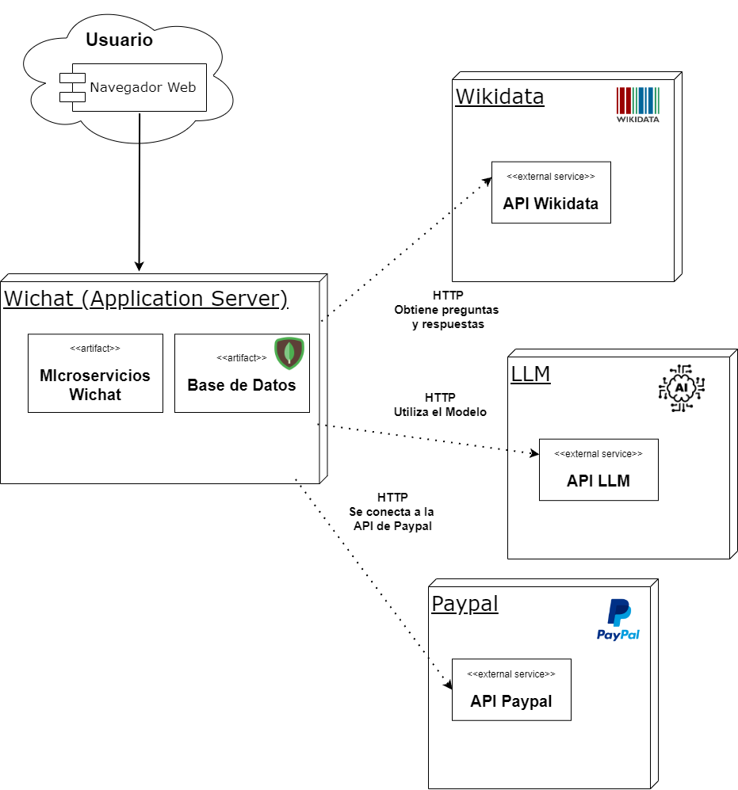

ifndef::imagesdir[:imagesdir: ../images]

[[section-context-and-scope]]
== Contexto y Alcance

ifdef::arc42help[]
[role="arc42help"]
****
.Contenido  
El ámbito y contexto del sistema, como su nombre lo indica, delimita el sistema (es decir, su ámbito) de todos 
sus interlocutores (sistemas y usuarios vecinos, es decir, el contexto del sistema). De este modo, especifica las interfaces externas.

Si es necesario, diferencie el contexto empresarial (entradas y salidas específicas del dominio) del contexto técnico (canales, protocolos, hardware)..

.Motivación
Las interfaces de dominio y las interfaces técnicas con los socios de comunicación se encuentran entre los aspectos más críticos de su sistema. Asegúrese de comprenderlas por completo.

.Formato
Varias opciones:

* Varios diagramas de contexto
* Listas de socios de comunicación y sus interfaces.

.Más información

Vea https://docs.arc42.org/section-3/[Context and Scope] en la documentación arc42.

****
endif::arc42help[]

=== Contexto de Negocio

image::../images/contexto-de-negocio.png[Contexto de Negocio]

[options="header",cols="1,2"]
|===
|Elemento|Descripción
| _Usuario_ | _El concursante que interactúa con la aplicación, juega y recibe pistas._
| _Base de Datos_ | _Sistema de almacenamiento que guarda información relevante sobre el usuario._
| _WIChat_ | _Aplicación web principal donde se desarrolla el juego._
| _Wikidata_ | _Fuente de donde se extraen las preguntas, las imágenes y las respuestas._
| _LLM_API_ | _API que integra un modelo de lenguaje que se utiliza para generar pistas dinámicas y conversacionales que ayudan al concursante a responder las preguntas._
|===

ifdef::arc42help[]
[role="arc42help"]
****
.Contenido
Especificación de todos los interlocutores (usuarios, sistemas informáticos, etc.) con explicaciones de las entradas y salidas o interfaces específicas del dominio. 
Opcionalmente, puede añadir formatos o protocolos de comunicación específicos del dominio.

.Motivación
Todas las partes interesadas deben comprender qué datos se intercambian con el entorno del sistema.

.Formato
Todo tipo de diagramas que muestran el sistema como una caja negra y especifican las interfaces del dominio con los socios de comunicación.

Como alternativa (o adicionalmente), puede utilizar una tabla. 
El título de la tabla es el nombre de su sistema, las tres columnas contienen el nombre del interlocutor, las entradas y las salidas.

****
endif::arc42help[]

=== Contexto Técnico

ifdef::arc42help[]
[role="arc42help"]
****
.Contenido
Interfaces técnicas (canales y medios de transmisión) que juntan el sistema con su entorno. Además un mapeo del dominio especifico de entrada/salida a los canales, es decir una explicación de qué entrada salida usa cada canal.

.Motivación
Muchos stakeholders toman decisiones arquitectónicas basadas en las interfaces técnicas entre el sistema y su contexto. En especial, los diseñadores de hardware o infraestructura deciden estas interfaces técnicas.

.Formato
E.g. Diagrama UML de despliegue describiendo canales con los sistemas vecinos,
junto a una tabla de mapeo mostrando las relaciones entre canales y la entrada/salida.

****
endif::arc42help[]

==== Diagrama de Despliegue

==== Explicación de Interfaces Técnicas

===== WebApp
Aplicación web hecha con React que aporta al usuario una interfaz con la que interactuar y por medio de la cual hacer las peticiones
correspondientes al backend

===== gatewayservice
API que hace de enlace entre las distintas partes de la aplicación. Funciona como una especie de fachada que sirve para que los
distintos microservicios no tengan por qué conocerse entre ellos, para comunicarse solo deben de hacer peticiones al gateway y este
hará una redirección de la petición al servicio correspondiente.

===== authservice
Servicio que se comunica con la base de datos de usuarios a fin de comprobar si los datos introducidos de inicio de sesión
se corresponden con un usuario

===== userservice
Servicio que se comunica con la base de datos de usuarios a fin de añadir usuarios y modificar los datos relativos a los usuarios

===== Base de Datos "userdb"
Base de datos que almacena toda la información de los usuarios como su nombre de usuario, sus datos de logIn, etc

===== gameservice
Servicio que guarda la información relativa a las partidas de los usuarios en la base de datos "bd". Además, gestiona 
los datos de configuración de la partida (topics e idioma), almacenandolos en una caché para un rápido acceso. Estos datos posteriormente
son utilizados por el questionservice para obtener las preguntas usando dicha configuración.

===== Base de Datos "bd"
Base de datos que almacena la información de las partidas jugadas por los usuarios

===== questionservice
Servicio que genera las preguntas por medio de plantillas para los diferentes topics e idiomas y utiliza Wikidata para la 
obtención de las respuestas correctas y falsas.

===== API WikiData
API del servicio web WikiData que aportará a la aplicación las imágenes para el juego, las respuestas a las mismas y las
pistas que el LLM utilizará para responder a los usuarios

===== llmservice
Servicio que, por medio de la respuesta correcta a la pregunta actual de la partida, procesará y responderá a las preguntas que tenga 
el usuario por medio de pistas, sin dar dicha respuesta correcta directamente

===== API LLM
Servicio externo que nos permite acceder al modelo de lenguaje y utilizarlo

==== Mapeo de Canales de Entrada/salida

[options="header",cols="1,2,2"]
|===
| Canal | Entrada | Salida
| WebApp | Peticiones HTTP del usuario indicando sus acciones | Responde con información a través de la interfaz.
| gatewayservice | Peticiones REST de los microservicios para realizar acciones en la aplicación | Respuesta con la información/acciones solicitadas obtenida de otros microservicios.
| authservice | Datos de inicio de sesión de un usuario | Resultado de comprobación de los datos de inicio de sesión
| userservice | Datos a insertar/modificar en la base de datos | Modificación o inserción completa a la base de datos
| Base de Datos "userdb" | Instrucciones para consultas o insercioes en base de datos | Resultado de las consultas o confirmación de las inserciones
| gameservice | Información de inicio de partida o final de partida | Responde con confirmación de las operaciones o con id de caché para rápido acceso a la configuración de la partida
| Base de Datos "bd" | Instrucciones para consultas o inserciones en base de datos | Resultado de las consultas o confirmación de las inserciones
| questionservice | Configuración de la partida | Pregunta con las posibles respuestas (correcta e incorrectas)
| API Wikidata | Solicitud de imagenes o pistas | Imagen nueva, respuesta o pista sobre la imagen ofrecida con anterioridad
| llmservice | Prompt de solicitud de pistas y respuesta correcta a la pregunta | Pista generada por el modelo evitando decir la respuesta correcta
| API LLM | Prompt de solicitud de pistas | Respuesta del modelo de lenguaje generada a partir del prompt
|===

