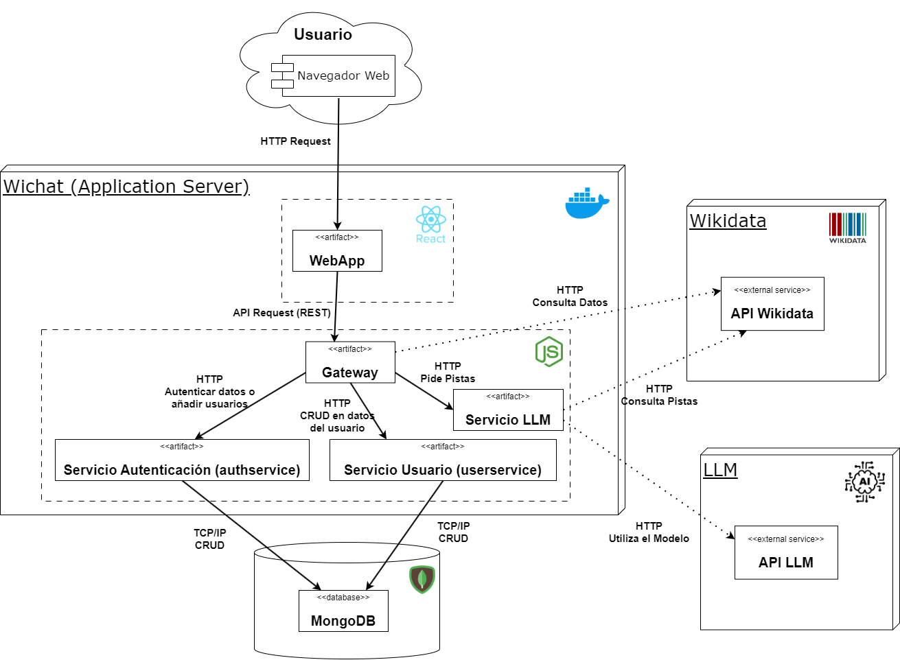

ifndef::imagesdir[:imagesdir: ../images]

[[section-context-and-scope]]
== Contexto y Alcance

ifdef::arc42help[]
[role="arc42help"]
****
.Contenido  
El ámbito y contexto del sistema, como su nombre lo indica, delimita el sistema (es decir, su ámbito) de todos 
sus interlocutores (sistemas y usuarios vecinos, es decir, el contexto del sistema). De este modo, especifica las interfaces externas.

Si es necesario, diferencie el contexto empresarial (entradas y salidas específicas del dominio) del contexto técnico (canales, protocolos, hardware)..

.Motivación
Las interfaces de dominio y las interfaces técnicas con los socios de comunicación se encuentran entre los aspectos más críticos de su sistema. Asegúrese de comprenderlas por completo.

.Formato
Varias opciones:

* Varios diagramas de contexto
* Listas de socios de comunicación y sus interfaces.

.Más información

Vea https://docs.arc42.org/section-3/[Context and Scope] en la documentación arc42.

****
endif::arc42help[]

=== Contexto de Negocio

[plantuml,png]
----
  actor Usuario
  database Pod as "Base de Datos"
  Usuario --> (WIChat): Interactúa
  WIChat --> (Wikidata): Solicita datos
  Wikidata --> (WIChat): Devuelve imágenes y respuestas
  WIChat --> (LLM_API): Envía consultas
  LLM_API --> (WIChat): Devuelve respuestas
  Usuario --> (Pod): Inicia sesión y registra resultados de partida
----

[options="header",cols="1,2"]
|===
|Elemento|Descripción
| _Usuario_ | _El concursante que interactúa con la aplicación, juega y recibe pistas._
| _Base de Datos_ | _Sistema de almacenamiento que guarda información relevante sobre el usuario._
| _WIChat_ | _Aplicación web principal donde se desarrolla el juego._
| _Wikidata_ | _Fuente de donde se extraen las preguntas, las imágenes y las respuestas._
| _LLM_API_ | _API que integra un modelo de lenguaje que se utiliza para generar pistas dinámicas y conversacionales que ayudan al concursante a responder las preguntas._
|===

ifdef::arc42help[]
[role="arc42help"]
****
.Contenido
Especificación de todos los interlocutores (usuarios, sistemas informáticos, etc.) con explicaciones de las entradas y salidas o interfaces específicas del dominio. 
Opcionalmente, puede añadir formatos o protocolos de comunicación específicos del dominio.

.Motivación
Todas las partes interesadas deben comprender qué datos se intercambian con el entorno del sistema.

.Formato
Todo tipo de diagramas que muestran el sistema como una caja negra y especifican las interfaces del dominio con los socios de comunicación.

Como alternativa (o adicionalmente), puede utilizar una tabla. 
El título de la tabla es el nombre de su sistema, las tres columnas contienen el nombre del interlocutor, las entradas y las salidas.

****
endif::arc42help[]

=== Contexto Técnico

ifdef::arc42help[]
[role="arc42help"]
****
.Contenido
Interfaces técnicas (canales y medios de transmisión) que juntan el sistema con su entorno. Además un mapeo del dominio especifico de entrada/salida a los canales, es decir una explicación de qué entrada salida usa cada canal.

.Motivación
Muchos stakeholders toman decisiones arquitectónicas basadas en las interfaces técnicas entre el sistema y su contexto. En especial, los diseñadores de hardware o infraestructura deciden estas interfaces técnicas.

.Forma
E.g. Diagrama UML de despliegue describiendo canales con los sistemas vecinos,
junto a una tabla de mapeo mostrando las relaciones entre canales y la entrada/salida.

****
endif::arc42help[]

==== Diagrama de Despliegue

==== Explicación de Interfaces Técnicas

===== Gateway
API que hace de enlace entre las distintas partes de la aplicación

===== Aplicación React
Aplicación web hecha con React que aporta al usuario una interfaz con la que interactuar y por medio de la cual hacer las peticiones
correspondientes al backend

===== Base de Datos de Usuarios
Base de datos que almacena toda la información referente a los usuarios como su nombre de usuario, sus datos de logIn, su histórico de partidas, etc

===== Servicio de Autenticación
Interfaz que se comunica con la base de datos de usuarios a fin de comprobar si los datos introducidos de inicio de sesión
se corresponden con un usuario relaciones

===== Servicio de Usuario
Interfaz que se comunica con la base de datos de usuarios a fin de consultar y actualizar la información referente a los usuarios y
sus partidas

===== Servicio LLM
Servicio que, por medio de las pistas obtenidas de WikiData, procesará y responderá a las pistas que pida el usuario

===== API LLM
Servicio externo que nos permite acceder al modelo de lenguaje y utilizarlo

===== API WikiData
API del servicio web WikiData que aportará a la aplicación las imágenes para el juego, las respuestas a las mismas y las
pistas que el LLM utilizará para responder a los usuarios

==== Mapeo de Canales de Entrada/salida

[options="header",cols="1,2,2"]
|===
| Canal | Entrada | Salida
| Aplicación React | Peticiones HTTP del usuario indicando sus acciones | Responde con información a través de la interfaz.
| Gateway | Peticiones REST de webapp para obtener datos como imágenes y respuestas o solicitar operaciones como iniciar sesión | Respuesta con la información solicitada.
| Servicio Autenticación | Datos de inicio de sesión de un usuario | Consulta de comprobación de los datos de inicio de sesión
| Servicio Usuario | Datos a consultar o insertar en la base de datos | Consulta o inserción completa a la base de datos
| Base de Datos de Usuarios | Instrucciones SQL para consultas o insercioes | Resultado de las consultas o confirmación de las inserciones
| Servicio LLM | Prompt de solicitud de pistas | Pista generada por el modelo a partir de información de Wikidata
| API LLM | Prompt de solicitu de pistas | Respuesta del modelo de lenguaje generada a partir del prompt
| API Wikidata | Solicitud de imagenes o pistas | Imagen nueva, respuesta o pista sobre la imagen ofrecida con anterioridad
|===

