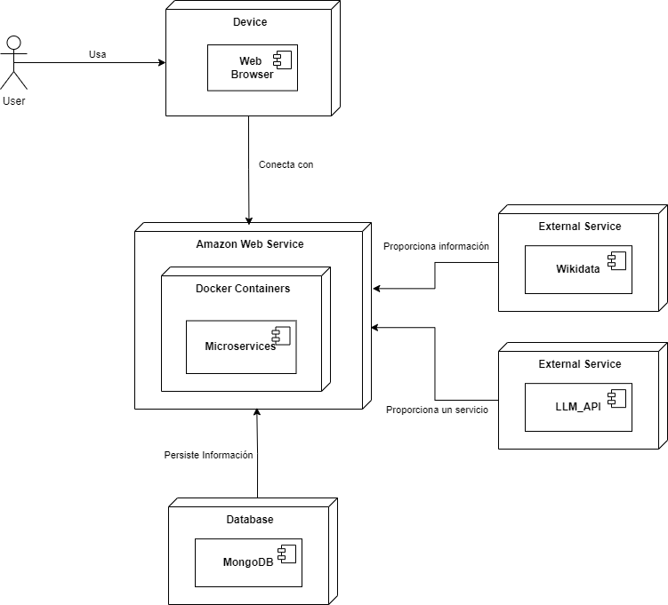

ifndef::imagesdir[:imagesdir: ../images]

[[section-deployment-view]]

== Vista de Despliegue

ifdef::arc42help[]
[role="arc42help"]
****
.Contenido
La vista de despliegue describe:

La infraestructura técnica utilizada para ejecutar tu sistema, con elementos de infraestructura como 
ubicaciones geográficas, entornos, computadoras, procesadores, canales y topologías de red, así como otros 
elementos de infraestructura.

La asignación de los bloques de construcción (software) a esos elementos de infraestructura.

A menudo, los sistemas se ejecutan en diferentes entornos, como el entorno de desarrollo, entorno de 
pruebas y entorno de producción. En tales casos, debes documentar todos los entornos relevantes.

Es especialmente importante documentar una vista de despliegue si tu software se ejecuta como un sistema 
distribuido con más de una computadora, procesador, servidor o contenedor, o cuando diseñas y construyes 
tus propios procesadores y chips de hardware.

Desde una perspectiva de software, es suficiente capturar solo aquellos elementos de la infraestructura 
necesarios para mostrar el despliegue de tus bloques de construcción. Los arquitectos de hardware pueden 
ir más allá y describir la infraestructura con el nivel de detalle que necesiten capturar.

.Motivación
El software no funciona sin hardware.
Esta infraestructura subyacente puede y va a influir en un sistema y/o en algunos conceptos transversales. 
Por lo tanto, es necesario conocer la infraestructura.

.Formato

Es posible que un diagrama de despliegue de alto nivel ya esté contenido en la sección 3.2 como contexto técnico, 
con tu propia infraestructura representada como UNA caja negra. 
En esta sección se puede hacer zoom en esa caja negra utilizando diagramas de despliegue adicionales:

* UML ofrece diagramas de despliegue para expresar esa vista. Úsalos, probablemente 
con diagramas anidados, cuando tu infraestructura sea más compleja.
* Si tus stakeholders (de hardware) prefieren otros tipos de diagramas en lugar de un diagrama de despliegue, permíteles usar 
cualquier tipo que sea capaz de mostrar nodos y canales de la infraestructura.

.Información Adicional

Consulta la https://docs.arc42.org/section-7/[Deployment View] en la documentación de arc42.

****
endif::arc42help[]

=== Infraestructura Nivel 1

ifdef::arc42help[]
[role="arc42help"]
****
Describe (usualmente mediante una combinación de diagramas, tablas y texto):

* La distribución de un sistema en múltiples ubicaciones, entornos, computadoras, procesadores, etc., así como las conexiones físicas entre ellos.
* Las justificaciones o motivaciones importantes para esta estructura de despliegue.
* Las características de calidad y/o rendimiento de esta infraestructura.
* La asignación de los artefactos de software a los elementos de esta infraestructura.

Para múltiples entornos o despliegues alternativos, copia y adapta esta sección de arc42 para todos los entornos relevantes.
****
endif::arc42help[]

Motivación::
* Escalabilidad: AWS permite escalar horizontalmente mediante la creación de múltiples instancias de contenedores según la demanda.
* Disponibilidad: La infraestructura de AWS facilita la alta disponibilidad a través de balanceadores de carga y zonas de disponibilidad.
* Integración con servicios externos: La integración con Wikidata y LLM_API permite extender las capacidades de la plataforma sin complejidad adicional.

Características de Calidad y Rendimiento::
* Bajo tiempo de respuesta: La cercanía geográfica de los servidores AWS al usuario final reduce la latencia.
* Mantenibilidad: Docker facilita la gestión de versiones de los microservicios y la rápida recuperación ante fallos.

Asignación de artefactos de software a la infraestructura::
* Microservicios: Desplegados como contenedores Docker dentro de AWS.
* Frontend (Web Browser): Ejecutado en el dispositivo del usuario, interactuando con la API del backend alojada en AWS.
* Base de Datos MongoDB: Desplegada en un contenedor propio dentro de AWS.

=== Infraestructura Nivel 2

ifdef::arc42help[]
[role="arc42help"]
****
Here you can include the internal structure of (some) infrastructure elements from level 1.

Please copy the structure from level 1 for each selected element.
****
endif::arc42help[]

image::../images/vista-de-despliegue-nivel-2.png[Vista de Despliegue Nivel 2]

Microservicios::
* WebApp: Servicio que sirve la aplicación frontend y se comunica con el GatewayService.
* GatewayService: Actúa como punto de entrada único para el frontend, enrutando solicitudes a los microservicios adecuados.
* Question Service: Gestiona las llamadas a Wikidata para conseguir las preguntas.
* UserService: Maneja las operaciones con los usuarios.
* AuthService: Gestiona la autenticación y autorización de usuarios.
* Game_Service: Controla la lógica de la aplicación (modelo de dominio, conexión con la base de datos).
* LlmService: Se conecta con la API de Gemini y gestiona el funcionamiento del LLM.
* Base de Datos: Almacena información de usuarios, partidas y preguntas.

