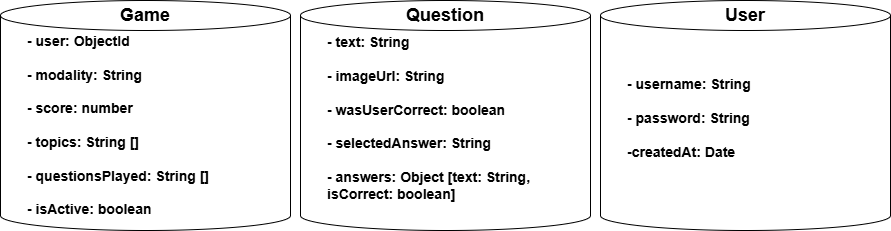

ifndef::imagesdir[:imagesdir: ../images]

[[section-concepts]]
== Conceptos transversales

ifdef::arc42help[]
[role="arc42help"]

****
.Content
Esta sección describe las regulaciones generales y las ideas de solución que son relevantes en múltiples partes (= transversales) de tu sistema.  
Estos conceptos suelen estar relacionados con múltiples bloques de construcción.  
Pueden incluir muchos temas diferentes, tales como:

* modelos, especialmente modelos de dominio  
* patrones de arquitectura o diseño  
* reglas para el uso de tecnologías específicas  
* decisiones principales, a menudo técnicas, de naturaleza global (= transversales)  
* reglas de implementación  

.Motivación  
Los conceptos forman la base de la _integridad conceptual_ (consistencia, homogeneidad) de la arquitectura.  
Así, son una contribución importante para lograr las cualidades internas de tu sistema.  

Algunos de estos conceptos no pueden asignarse a bloques de construcción individuales, por ejemplo, seguridad o protección.  

.Forma  
La forma puede variar:

* documentos conceptuales con cualquier tipo de estructura  
* extractos de modelos transversales o escenarios utilizando notaciones de las vistas de arquitectura  
* implementaciones de muestra, especialmente para conceptos técnicos  
* referencia al uso típico de marcos estándar (por ejemplo, usar Hibernate para el mapeo objeto-relacional)

.Estructura  
Una estructura potencial (pero no obligatoria) para esta sección podría ser:

* Conceptos de dominio  
* Conceptos de experiencia de usuario (UX)  
* Conceptos de seguridad y protección  
* Patrones de arquitectura y diseño  
* "Bajo el capó"  
* Conceptos de desarrollo  
* Conceptos operacionales  

Nota: puede ser difícil asignar conceptos individuales a un tema específico de esta lista.

image::08-concepts-EN.drawio.png["Posibles temas para conceptos transversales"]

.Más información

Consulta https://docs.arc42.org/section-8/[Conceptos] en la documentación de arc42.
****
endif::arc42help[]

=== Arquitectura de microservicios

Hemos decidido que nuestra arquitectura se basará en microservicios, lo que significa que cada parte de la aplicación se dividirá en un servicio que realiza una función específica. Los servicios pueden comunicarse entre sí utilizando sus respectivas API. Además, en nuestra arquitectura tienen mucha importancia el papel del API Gateway, cuya función es servir como intermediario en la interacción entre servicios, de forma que estos solo se encuentren ligeramente acoplados al gateway y no a múltiples servicios diferentes.

=== Experiencia del usuario

La aplicación será un sitio web donde los usuarios podrán jugar a WICHAT. La funcionalidad básica consiste en mostrar una imagen y una pregunta, y el usuario deberá seleccionar la opción correcta. Además es el propio usuario el que, si se encuentra atascado en una pregunta, puede hacer una consulta, pidiendo una pista, a un modelo de lenguaje.

=== Persistencia

En cuanto a la gestión de datos en la aplicación, cabe mencionar que en todos los casos usamos MongoDB. El microservicio game_service gestiona la base de datos del juego, las preguntas y el historial de partidas, mientras que el microservicio user se encarga de la base de datos de los usuarios.

=== Seguridad

Para garantizar la seguridad de los usuarios, la aplicación cifra sus contraseñas antes de almacenarlas en la base de datos utilizando el algoritmo bcrypt, lo que asegura que las contraseñas no se guarden de manera visible ni en texto claro. Además, se realiza una validación para asegurarse de que los campos esenciales, como el nombre de usuario y la contraseña, estén presentes en la solicitud antes de crear un nuevo usuario, lo que garantiza que los datos necesarios sean correctos y completos. Además, añadimos un control de fuerza bruta para el login. Si se falla múltiples veces seguidas al intentar hacer login, se bloquea la IP durante varios minutos.

=== Pruebas

Para evitar errores en nuestra aplicación, realizaremos pruebas que cubrirán tanto el frontend como el backend. Se realizarán las pruebas de aquellas funcionalidades de alta relevancia en la aplicación, no pruebas muy específicas que puedan tener poca relevancia en el funcionamiento (como comprobar si un botón cambia de color cuando se pulsa). En su lugar, nos centraremos en pruebas más generales que aseguren que todo funciona correctamente, aunque en algunos casos incluiremos aspectos más detallados si es necesario, pero solo para funcionalidades que no son cruciales.

=== Internacionalización

Hemos decidido adaptar la aplicación para que esté disponible en español e inglés, permitiendo que los usuarios elijan su idioma preferido.