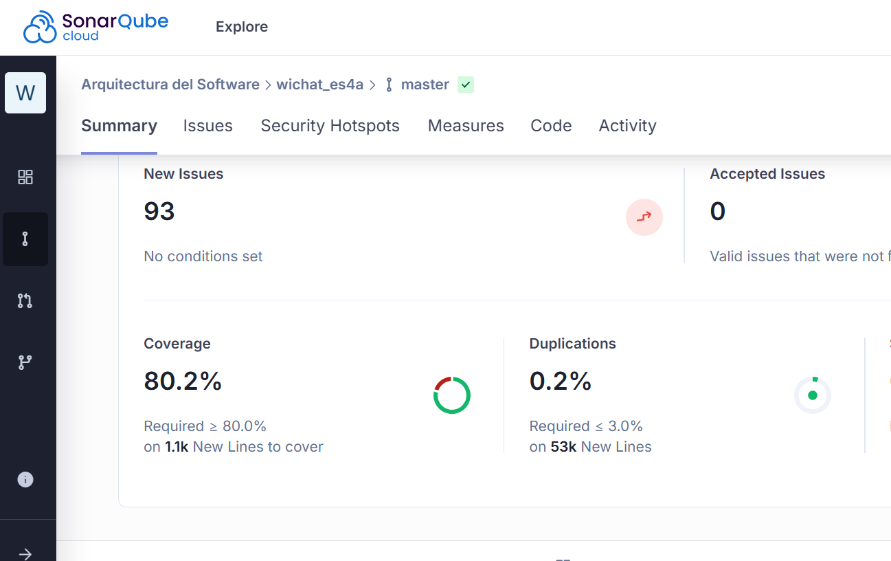

ifndef::imagesdir[:imagesdir: ../images]

[[section-testing-report]]
== Informe de pruebas
ifdef::arc42help[]
[role="arc42help"]
endif::arc42help[]

=== Test unitarios
Cada componente del Front-End tiene sus correspondientes pruebas unitarias que verfican que funciona correctamente, proporcionando seguridad, fiabilidad y consistencia al proyecto realizado.
**Cambio de contraseña**  
Para la cobertura de código utilizamos la herramienta SonarQube.Esta herramienta ofrece una métrica que indica qué porcentaje del código fuente ha sido ejecutado por las pruebas automatizadas (unitarias, de integración, etc.). Es un indicador clave de la calidad del software y de cuán bien está siendo probado.
Para este proyecto nos piden un 80% de cobertura de código y menos de un 3% de duplicación. En la siguiente imagen vemos como cumplimos con estos dos parámetros:

=== Test E2E

Los tests end-to-end (E2E) se utilizan para verificar que toda la aplicación funciona correctamente desde la perspectiva del usuario final. Simulan escenarios reales de uso, interactuando con la interfaz tal como lo haría un usuario, para asegurar que todos los componentes del sistema (frontend, backend, base de datos, etc.) funcionan como se espera.

En nuestro proyecto hemos incorporado los siguientes casos de prueba E2E:

. **Cambio de contraseña**  
  Verifica el correcto funcionamiento del formulario de cambio de contraseña, incluyendo los casos de éxito y los principales errores de validación: coincidencia entre contraseñas, longitud mínima, uso de mayúsculas, números, espacios y manejo de errores en la contraseña actual.

. **Simulación de un juego**  
  Verifica que el usuario pueda configurar e iniciar una partida con distintas opciones, completar o salir de ella antes de tiempo, consultar el historial de partidas jugadas y solicitar pistas al modelo LLM durante la partida.

. **Inicio de sesión**  
  Comprueba que el sistema gestione correctamente intentos de inicio de sesión con credenciales inválidas, incluyendo la visualización de mensajes de error y la limitación de intentos fallidos por motivos de seguridad.

. **Registro de usuario**  
  Verifica que un nuevo usuario pueda completar el formulario de registro correctamente y que el sistema gestione adecuadamente errores comunes como contraseñas inválidas, contraseñas no coincidentes y nombres de usuario ya registrados.

=== Test de carga
Los tests de carga miden el rendimiento antes de la carga normal o de carga máxima. Para llevar a cabo estas pruebas hemos utilizado la herramienta Artillery. Mediante ficheros .yml podíamos especificar todos los escenarios posibles.

Toda la información sobre las pruebas realizadas en nuestro trabajo aparece en el este enlace:
link:../pdfs/Informe_Resultados_Pruebas_De_Carga.pdf[Informe de resultados de pruebas de carga en PDF]
